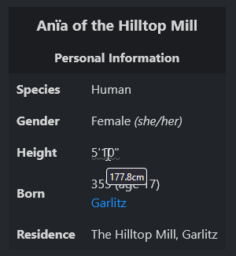

# Plugins for Otterwiki
This is a collection of plugins I wrote for [An Otter Wiki](https://github.com/redimp/otterwiki), a minimalist python-based wiki software I use.

I wrote these for personal use (documenting my solo D&D campaign) so there's no guarantee they will work (well) for anything else, but I though I might as well share them!

## List of Plugins
### otterwiki-infobox


Allows you to insert Wikipedia-style infoboxes into your Wiki pages by starting a code tag with ` ```infobox` and describing the box's content using `yaml`. In general, the `yaml` object's keys go in the left, and the values in the right column, except for some special reserved fields, prefixed with `i_[...]`.

For example, the image above can be created with the following:
```yaml
i_title: Garlitz
i_image:
  url: https://images.metmuseum.org/CRDImages/ep/original/DT313144.jpg
  desc: \"A Village in a Valley\" (Théodore Rousseau, late 1820s)
i_section: Town
Population: 670
Region: "[[Great Eastern Plains|Places/Great Eastern Plains]]"
Government: Town Council (*see [Politics](#Politics)*)
Exports: Flowers
```

### otterwiki-imperial-helper


This plugin simply adds tooltips for converting imperial units to normal (metric) units and inserting them as tooltips. Usually I would just use metric units to begin with, but alas, I'm stuck with D&D's bad decisions once again... 😔

The tooltips use the `title` html property, which isn't easily accessible on every platform (nor picked up by screen readers), so watch out!

Supported units:
|   Source Unit   | Expected Format  | Target Unit |
|:---------------:|:----------------:|:-----------:|
| feet and inches |   `\d+' ?\d+"`   |     cm      |
|      feet       | `\d+ ?ft(?!\w)`  |     cm      |
|     inches      | `\d+ ?in(?!\w)`  |     cm      |
|      miles      | `\d+ ?mi(?!\w)`  |     km      |
|     pounds      | `\d+ ?lbs(?!\w)` |     kg      |